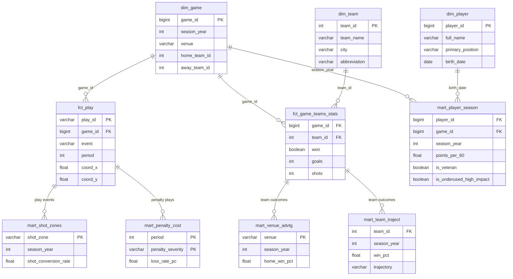

# Pipeline Model ERD

Full entity-relationship diagram — dims, facts, and gold marts.
Verified against actual dbt SQL. Last updated June 2026.

> **Note:** `dim_player` and `dim_team` are also consumed by Power BI
> for readable names — those are BI-layer connections, not dbt SQL joins.

